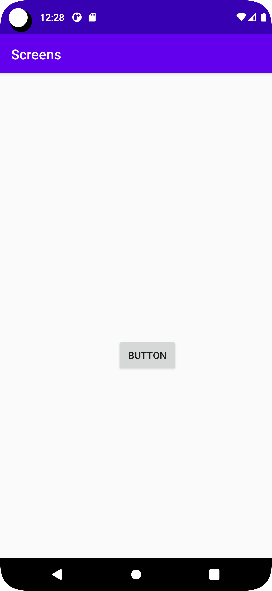
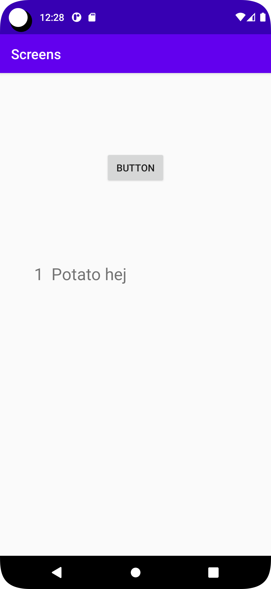

**Assignment 4: Activities & Intents**
# Add activity
Skapa en ny tom aktivitet inom mappen `app`. Detta skapa två filer. En `java script fil` inom java mappen samt en `layout fil` inom layout mappen under res mappen .

# Button inside first activity 
Genom att placera in en knapp med ett `id` kallat button. första sidan består av en `constraitlayout` som leder till att knappen blev placerad centralt inom applikationen då den utgår ifrån 
sidorna av layouten.
```
<Button
        android:id="@+id/button"
        android:layout_width="wrap_content"
        android:layout_height="wrap_content"
        android:text="Button"
        app:layout_constraintBottom_toBottomOf="parent"
        app:layout_constraintEnd_toEndOf="parent"
        app:layout_constraintHorizontal_bias="0.554"
        app:layout_constraintStart_toStartOf="parent"
        app:layout_constraintTop_toTopOf="parent"
        app:layout_constraintVertical_bias="0.588" />
```
# Add data to the intent bundle using extras
Genom att `identifiera knappen` med hjälp av knappens nämnda `id` inom xml filen. Detta skapar en `variabel` för elementet som motsvarar `id` namnet.
Genom att skapa en `clicklistener` utförs koden som befinner sig mellan måsvingarna. I detta fall innebär detta att det skapas en `Intent 
med extras` som motsvarar data. Detta görs med hjälp av `onclick`. `StartActivity('Intent')` Körs `Intent variabeln` som nämns inom koden. 
```
        Button button = (Button) findViewById(R.id.button);
        button.setOnClickListener(new View.OnClickListener() {
            @Override
            public void onClick(View v) {
                Intent intent = new Intent(MainActivity.this, second_activity.class);
                intent.putExtra("food", "Potato"); // Optional
                intent.putExtra("count", 1); // Optional
                startActivity(intent);
                
```

# Add widget to show intent data
Genom att fördefinnera variabeln `collectvalue` för att nå `widgeten` Textview som man vill förändra innehållet inom. Detta möjliggör så
att man kan definiera `collectvalue` värdet med hjälp av att hämta id som motsvarar
textview. Genom if satsen kontrolleras om de existerar
några lagrade värden för att motverka `null` värden. sedan hämtar man ut extra datan ur den `lagrade datan` med hjälp av `extras.getstring("");`
När man har hämtat datan kan man använda sig av `textview` variabeln för att lägga till en text komponent via `settext()`.
```
        public class second_activity extends AppCompatActivity {
        private TextView collectvalue;
```

```
        TextView collectvalue = (TextView) findViewById(R.id.textview);
        Bundle extras = getIntent().getExtras();
        if (extras != null) {
            String food = extras.getString("food");
            int count = extras.getInt("count");

            collectvalue.setText(count+ " " + " " +food+ " left");
        }
```


_Pic of Main_Page_


_Pic of Second_page_